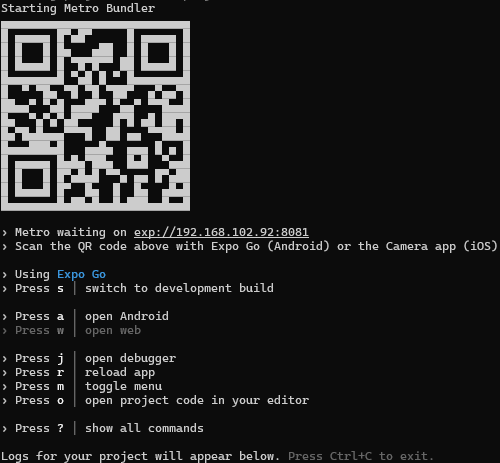

# FinSolution APP Docs

Questo repository contiene l'app mobile di FinSolution, che è stata sviluppata usando [React-Native](https://reactnative.dev/) in combinazione con il framework [Expo](https://expo.dev).

## Requisiti di sistema

- Node JS >= 22.16.0
- NPM >= 10.9.2

## Per poter eseguire il codice in locale con [Expo Go](https://expo.dev/go)

1. Scaricare una copia del repository.

```bash
git clone https://github.com/Fin-Solution/MobileApp.git
```

2. Recarsi nella cartella del download.

```bash
cd ./FinSolution
```

3. Poi effetuare l'installazione delle dipendenze con il bundler a propria scelta (npm).

```bash
npm i # npm install
```

4. Inizializzare l'applicazione.

```bash
npm run start # --clear se si vuole effetuare una clean start
```

5. Collegarsi scansionando il codice qr con app Expo Go.



Dopo averla inizializzata potrai trovare un menu di di accesso premendo delle dei tasti es: (s => fare lo switch in dev build, più informazioni di seguito).

## Riferimenti

- [development build](https://docs.expo.dev/develop/development-builds/introduction/)
- [Android emulator](https://docs.expo.dev/workflow/android-studio-emulator/)
- [iOS simulator](https://docs.expo.dev/workflow/ios-simulator/)
- [Documentazione Expo](https://docs.expo.dev/)
- [Expo Go](https://expo.dev/go), applicazione limitata per il debug della nostra app
